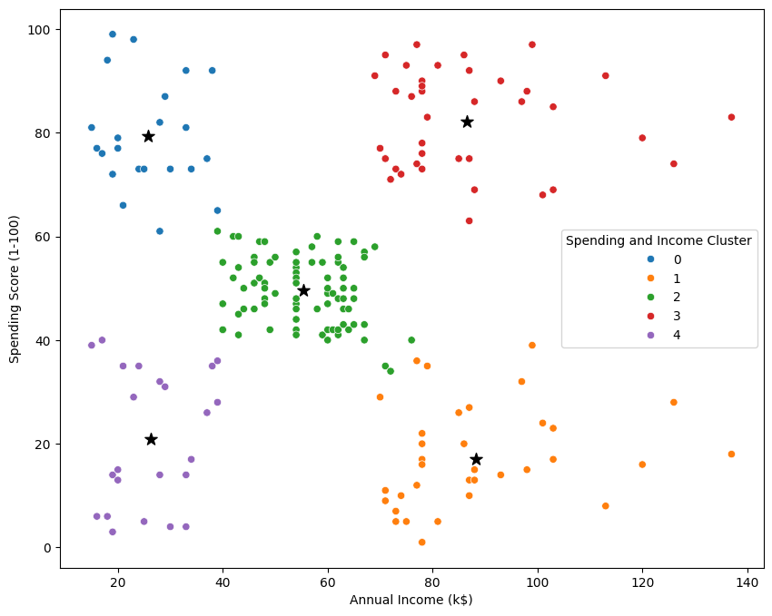

# Customer Segmentation using K-Means Clustering
 

## Project Overview

The Customer Segmentation project aims to categorize customers into distinct groups based on their behavior and attributes using the Mall Customers dataset. The primary goal is to perform customer segmentation using clustering techniques, particularly the K-Means algorithm. This segmentation helps businesses understand their customer base, tailor marketing strategies, and improve customer service.

### 1. Business Understanding

The objective is to identify distinct customer segments to help a mall better understand the different customer profiles. This understanding will allow the mall to tailor marketing efforts and services to meet the specific needs of each segment, ultimately improving customer satisfaction and increasing revenue.

### 2. Data Understanding

The dataset used in this project is the Mall Customers dataset, which contains the following columns:

- **CustomerID**: Unique ID assigned to each customer.
- **Gender**: Gender of the customer.
- **Age**: Age of the customer.
- **Annual Income (k$)**: Annual income of the customer in thousands of dollars.
- **Spending Score (1-100)**: Score assigned to the customer based on their spending behavior.

Initial exploration involves checking the first few rows and statistical summaries to understand the data distribution.

```python
import pandas as pd
import seaborn as sns
import matplotlib.pyplot as plt
from sklearn.cluster import KMeans
import warnings
import numpy as np
warnings.filterwarnings('ignore')

df = pd.read_csv("/content/Mall_Customers.csv")
df.head()
df.describe()
```

### 3. Data Preparation

Univariate analysis involves analyzing individual columns to understand their distribution. This includes visualizing the distribution of Age, Annual Income, and Spending Score using KDE plots and box plots.

#### Distribution of Age by Gender


 
#### Distribution of Annual Income by Gender

 

```python
sns.distplot(df['Annual Income (k$)'], color='orange')
columns = ['Age', 'Annual Income (k$)','Spending Score (1-100)']
for i in columns:
    plt.figure()
    sns.distplot(df[i])
```

Bivariate analysis examines the relationship between two variables. Scatter plots and pair plots are used to visualize the relationship between Annual Income and Spending Score, segmented by Gender.

Correlation analysis helps identify the relationships between numeric variables. A heatmap is used to visualize the correlation matrix.

#### Correlation Matrix

 

```python
correlation_matrix = df.corr()
sns.heatmap(correlation_matrix, annot=True, cmap='RdYlBu')
```

### 4. Modeling

We use the K-Means clustering algorithm to segment customers.
 
 
#### Univariate Clustering

We perform K-Means clustering on the Annual Income column to segment customers into three income groups.

```python
clustering1 = KMeans(n_clusters=3)
clustering1.fit(df[['Annual Income (k$)']])
df['Income Cluster'] = clustering1.labels_
```

#### Bivariate Clustering

We extend the clustering to two variables: Annual Income and Spending Score, and segment customers into five clusters.

#### Clusters of Spending Score vs Annual Income

 

```python
clustering2 = KMeans(n_clusters=5)
clustering2.fit(df[['Annual Income (k$)','Spending Score (1-100)']])
df['Spending and Income Cluster'] = clustering2.labels_
```

### 5. Evaluation

1. **Univariate Clustering**:
   - Customers were segmented into three clusters based on Annual Income.
   - Cluster 0: High Income
   - Cluster 1: Medium Income
   - Cluster 2: Low Income

2. **Bivariate Clustering**:
   - Customers were segmented into five clusters based on Annual Income and Spending Score.
   - Each cluster represents a unique combination of income and spending behavior, helping businesses target specific customer segments more effectively.

### 6. Deployment

Customer segmentation using K-Means clustering provides valuable insights into customer behavior, allowing businesses to tailor their marketing and customer service strategies. This project demonstrates the application of clustering techniques to identify distinct customer segments, which can lead to more personalized and effective business strategies.

### Future Work

Future enhancements could include:

- Incorporating additional features for clustering.
- Exploring other clustering algorithms such as DBSCAN or hierarchical clustering.
